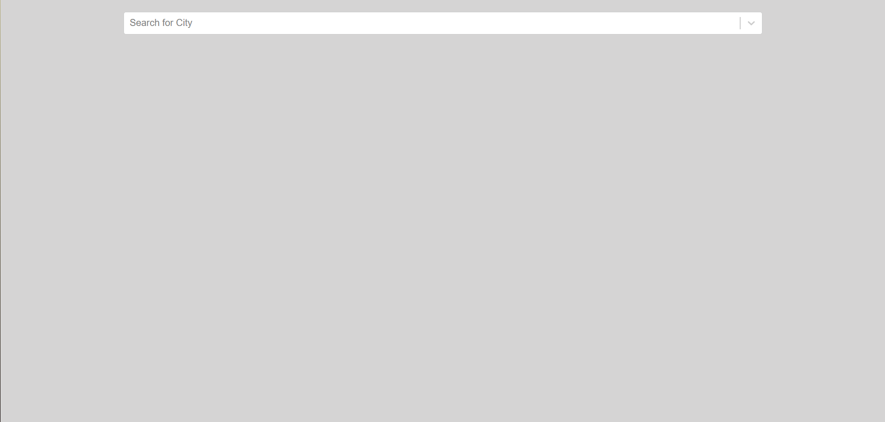
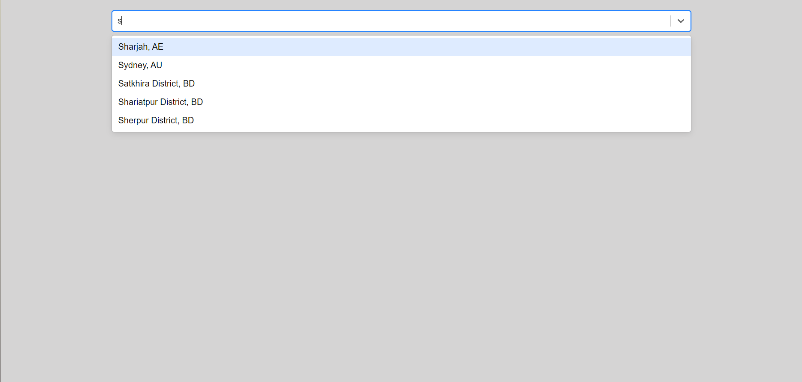
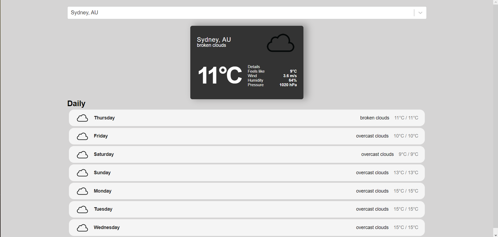
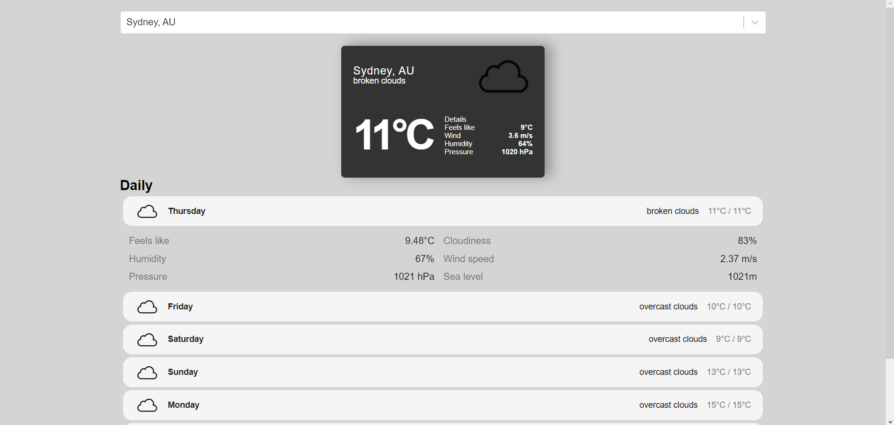

# Weather Website
This is a simple weather website built using React. It allows users to search for a country and view the current weather information as well as a weekly weather forecast.

# Features
- Autocomplete search bar: Users can type in the name of a city and gets suggestion as they type.
- Current weather display: The website fetches the current weather data for the selected country and displays it, including temperature, humidity, wind speed, and weather conditions.
- Weekly forecast: Users can also view the weather forecast for the upcoming week, including the temperature range and weather icons.
- Extra information about the weather: In each day it shows information about the humidity, cloudiness chance, pressure, sea level, wind speed and the temperature feels like. 

# API
**GeoDB Cities**
by Michael Mogely
https://rapidapi.com/wirefreethought/api/geodb-cities

**Open Weather**
https://openweathermap.org

# Screenshot of Project

